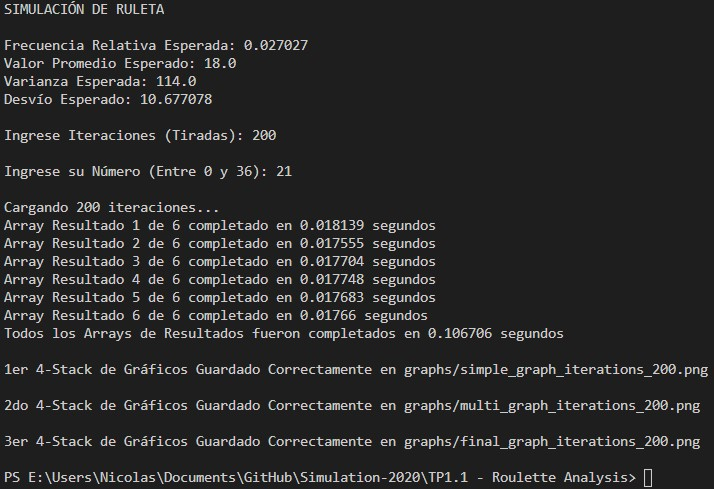
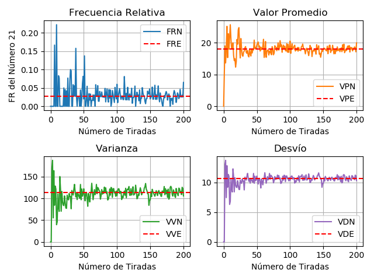
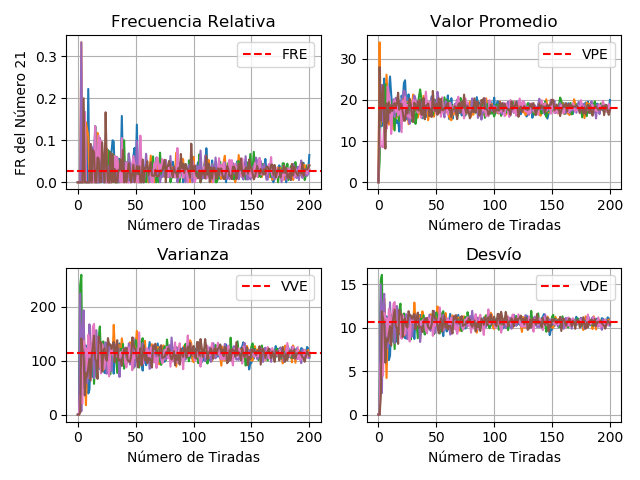
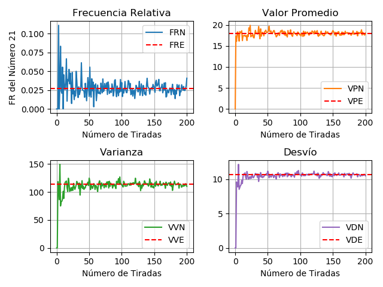

# TP1.1 - Roulette Analysis
Statistical analysis of an 'european' roulette (Graphs and prints of this first simulation are in spanish)

## Example
Iterations: 200, Number: 21

#### Console output

#### Graphs for the first Array of Results

#### Graphs for all the Arrays of Results at the same time

#### Graphs for the average values of all the Arrays of Results

