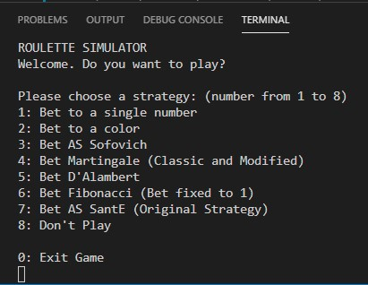
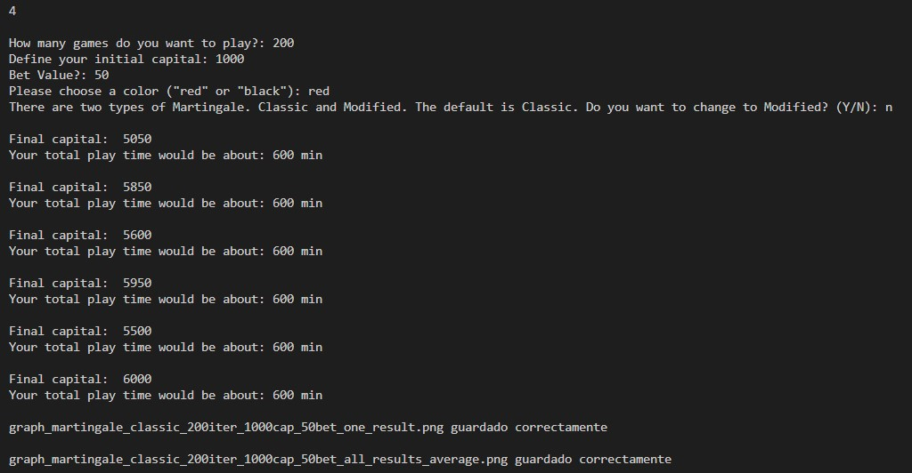
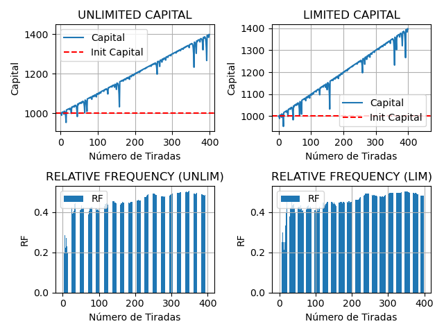
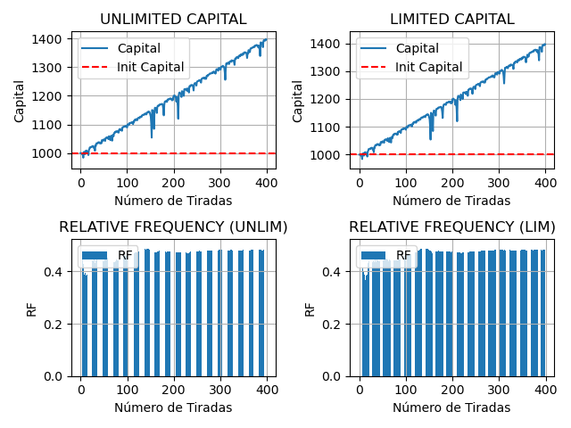
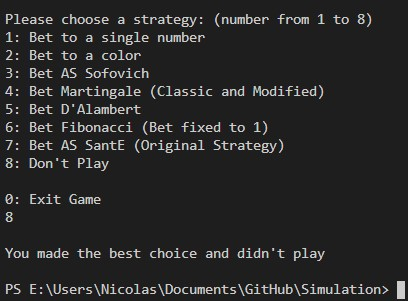

# TP1.2 - Strategies Roulette Simulation
Different strategies for playing roulette will be used (simulated) in order to analyze the benefits and / or disadvantages of them

## Menu Example

## Output Example
Strategy: Modified Martingale, Iterations: 200, Initial capital: $1000, Bet value: $50 (bet:capital ratio of 1:20)

#### Console Output

## Graphs Example
Strategy: Modified Martingale, Iterations: 400, Initial capital: $1000, Bet value: $50 (bet:capital ratio of 1:1000)

#### Graphs for one game results

#### Graphs for the average values of all games results

## Don't Play Example

