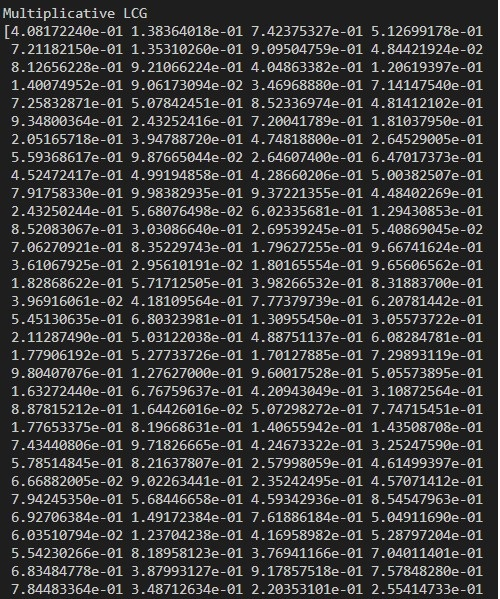
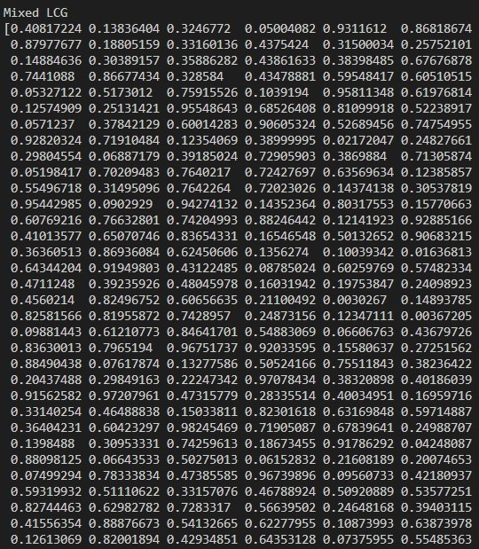
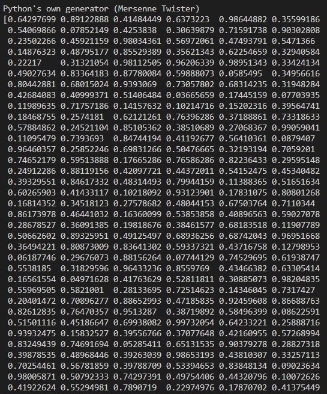
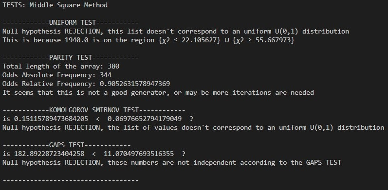
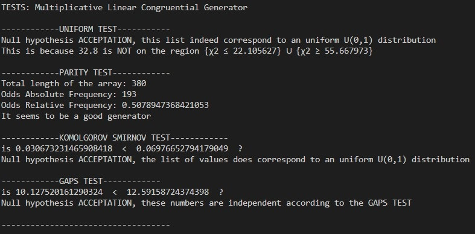
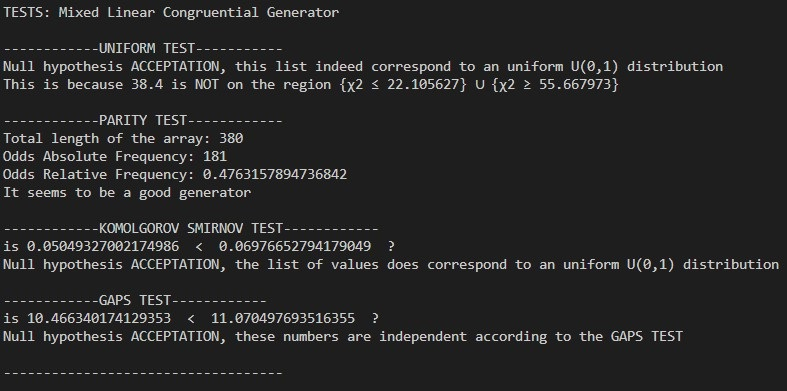

# TP2.1 - Pseudorandom Generators
Study of pseudo-random numbers generators, then performing generation quality tests on them

## Pseudorandom Generators Programmed
Middle Squared Method

Multiplicative Linear Congruential Generator (LCG)

Mixed Linear Congruential Generator (LCG)

Python's own Generator (Mersenne-Twister)

## Tests Programmed
Goodness of Fit (Pearson - Chi Squared Approach)

Parity Test

Kolmogorov-Smirnov Test

Gaps Test

## Example
Pseudorandom Numbers: 380

### Console: Start output

### Separated Scatterplots

### Simultaneous Scatterplots (Without MSM)

### Separated Histograms

### Simultaneous Histograms (Without MSM)

### Tests Results' summaring table

### Console: Pseudorandom arrays

### Console: More detail of Tests

### Console: Final output

