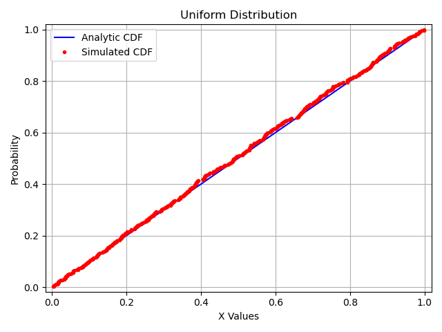
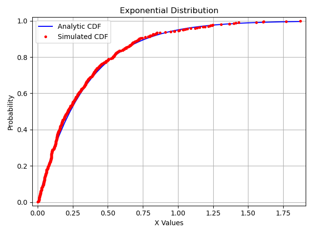
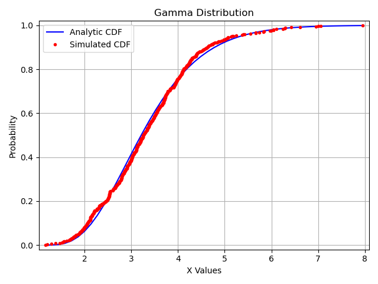
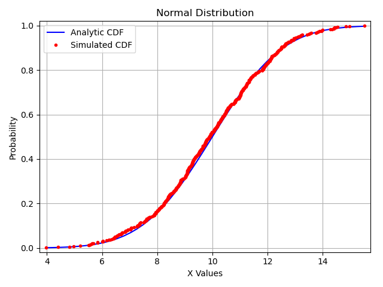

# TP2.2 - Pseudorandoms with Different Distributions
Study of pseudo-random numbers with different distribution's generator algorithms, then performing some tests on them

## Continuous Probability Distributions Programmed
Uniform

Exponential

Gamma

Normal

## Discrete Probability Distributions Programmed
Binomial

Negative Binomial (Pascal)

Hypergeometric

Poisson

Empirical

## Tests
Statistics Parameters: Analytic vs Simulated (Mean and Variance)

Kolmogorov-Smirnov

Cumulative Distribution Function (CDF) Comparative

## Example of Continuous Distribution comparison results
Pseudorandom Numbers: 500

Graphics: Cumulative Distribution Function (Analytic vs Simulated)

