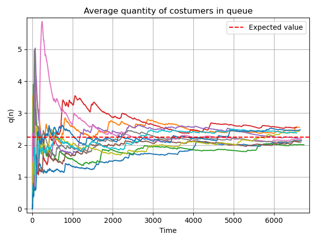
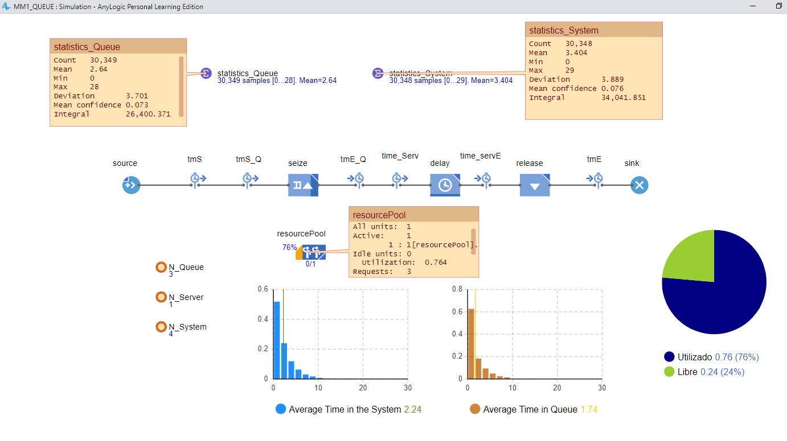

# TP3.0 - Single-server Queuing System
M/M/1 Queue Model: Simulation and Analysis of common performance measures

## Models Comparison
Analytic Solutions

Python Simulation

AnyLogic Simulation

## Performance Measurements Analyzed
Average quantity of costumers in queue

Average delay time in queue

Average quantity of costumers in the system

Average delay time in queue

Server utilization

N customers in system probability

Denial of service probability

## Example in the Python Simulations
Simulation runs: 10, Total Customers Quantity: 10000, Arrival Rate: 1.5, Service Rate: 2

Graphics: Simulation results VS Expected values

## Example in the AnyLogic Simulations
Simulation runs: 1, Total Customers Quantity: 30000, Arrival Rate: 1.5, Service Rate: 2

#### Model

#### Results

